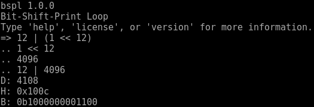
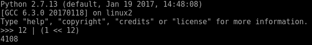

# bspl
Bit-Shift-Print Loop

## Introduction

`bspl` is a [REPL](https://en.wikipedia.org/wiki/Read%E2%80%93eval%E2%80%93print_loop)
for practising bitwise operations.

Born out of frustration while completing labs for my undergrad operating systems
course, I wanted a tool for quickly prototyping and tracing complex bitwise operations.

And the equivalent using the Python REPL.

## Installation

### Cargo

`cargo install bspl`

## Usage

Start `bspl` then type `help` for more information.

## Design

I wrote about the design of this project in [DESIGN.md](./DESIGN.md).

## References

See [REFERENCES.md](./REFERENCES.md).

## Roadmap

Support for additional bases

Add Octal to supported bases
